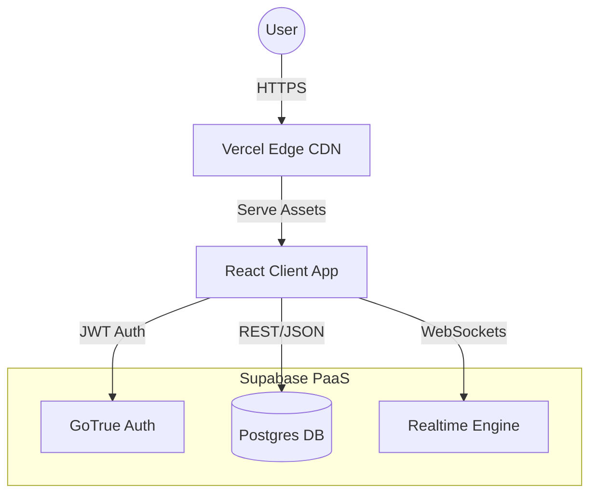
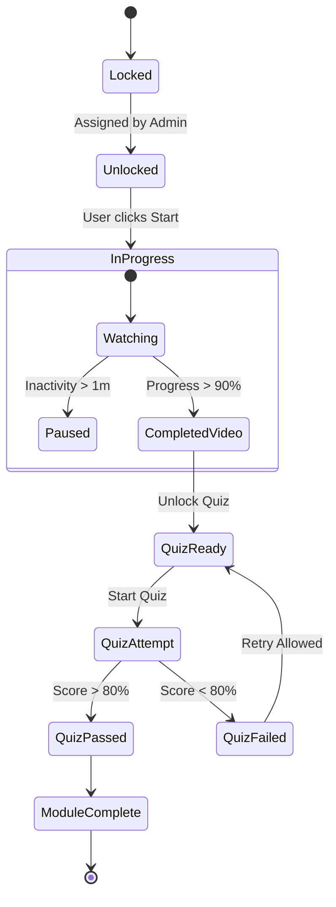

# Learning Tracker App — System Requirements Specification

**Version:** 4.2 (Stable Release)  
**Date:** October 26, 2023  
**Status:** **READY FOR IMPLEMENTATION**  

---

## 1. Objective

The **Learning Tracker App** is a streamlined utility designed to operationalize training for a 10-person team. It replaces ad-hoc spreadsheet tracking with a proactive, friction-free system that allows specific video/course assignment, automated progress tracking, and knowledge verification.

**Primary Goal:** Eliminate administrative follow-up time by **80%** while providing learners with a centralized, purpose-built environment for upskilling.

---

## 2. User Personas

### 2.1 Admin Persona: "Manager Mike"
*   **Role:** Engineering Team Lead.
*   **Motivation:** "I need to know my team is compliant without nagging them."
*   **Critical Success Factor:** **Visual Velocity.** He expects to open the dashboard and see a "Green Board" (Team Status) in less than 5 seconds.
*   **Pain Points:** Manually checking Slack messages or Google Sheets to see if someone finished a video.

### 2.2 Learner Persona: "Developer Sarah"
*   **Role:** Software Engineer.
*   **Motivation:** "I need to learn this new skill quickly without administrative hurdles."
*   **Critical Success Factor:** **Cognitive Flow.** She needs to watch, learn, and take notes without fighting a clunky UI.
*   **Pain Points:** Context switching. Losing notes or forgetting which second in a video contained the critical info.

---

## 3. Tech Stack

*Per the project brief, we evaluated three distinct architectural approaches for a lightweight build.*

### Option 1: No-Code / Low-Code (Airtable + Softr)
*   **Verdict:** **Rejected.** Limitations on the core "Note-Taking" feature make this non-viable for the desired UX.

### Option 2: MERN Stack (MongoDB, Express, React, Node)
*   **Verdict:** **Rejected.** Too heavy for the current team size. High operational overhead.

### Option 3: Minimal Backend + Static Frontend (Supabase + React) — **RECOMMENDED**
*   **Why it wins:**
    *   **Lightweight:** Zero backend code to manage.
    *   **Professional:** Enterprise-grade Security (RLS) is free.
    *   **Scalable:** Handles the 10-user scale effortlessly.

---

## 4. UI/UX Concept

### 4.1 Learner Dashboard (The "Focus" View)
```text
+---------------------------------------------------------------+
|  [LOGO]  LearningTracker                        [Avatar]      |
+---------------------------------------------------------------+
|                                                               |
|   🎯 ACTIVE PRIORITY                                          |
|   +-------------------------------------------------------+   |
|   |  System Design Principles: CAP Theorem                |   |
|   |  [#####################.......] 72% Complete          |   |
|   |  [ CLICK TO RESUME > ]                                |   |
|   +-------------------------------------------------------+   |
|                                                               |
|   📅 UPCOMING MODULES                                         |
|   |-- React Hooks Deep Dive (Due: Oct 28)                     |
|                                                               |
+---------------------------------------------------------------+
```

### 4.2 Admin Dashboard (The "Green Board" View)
```text
+-----------------------------------------------------------+
|  [MENU]  Team Overview      [+ Assign Module]             |
+-----------------------------------------------------------+
|                                                           |
|  📊 TEAM HEALTH:  🟢 90% Compliant                        |
|                                                           |
|  NAME             MODULE                  STATUS   SCORE  |
|  ---------------  ----------------------  -------  -----  |
|  Sarah Dev        React Hooks             ✅ DONE   100%  |
|  John Backend     PostgreSQL Index        ⏳ 45%     --   |
|  Mike Junior      Git Flow Basics         🔴 LATE    --   |
|                                                           |
|  [ Send "Nudge" to Overdue Users (1) ]                    |
+-----------------------------------------------------------+
```

---

## 5. Key Features

### 5.1 Progress Tracking
*   **FR-01:** System acts as a "Smart Watchdog", tracking video progress via heartbeats (30s intervals).
*   **FR-02:** Scrubber manipulation (skipping ahead) must not count towards "Watch Time".
*   **FR-03:** Modules are only marked "Complete" when Video Progress > 90% AND Quiz Score > 80%.

### 5.2 Knowledge Checks (Quizzes)
*   **FR-04:** Quizzes are Gate-Locked. A user cannot attempt the quiz until the video portion is completed.
*   **FR-05:** System provides "Instant Rationale" feedback immediately after a quiz submission.

### 5.3 Note-Taking Intelligence
*   **FR-07 (Deep Linking):** Notes are timestamp-aware. Clicking a note seeks the video player to that exact moment.
*   **FR-08 (Privacy):** Notes are visible *only* to the author (Learner). Admin has no access.

---

## 6. System Architecture (V4.2)

### 6.1 High-Level Architecture (C4 Component View)
*   **Frontend:** React SPA (Vite) hosted on Edge CDN.
*   **Backend:** Supabase SaaS (providing Auth, Database, and Realtime subscriptions).



### 6.2 Module State Logic (Flowgraph)


---

## 7. Deployment Strategy (V4.2)

### 7.1 Hosting Infrastructure
*   **Frontend:** **Vercel** (Global Edge Network).
*   **Backend:** **Supabase Cloud**.

### 7.2 CI/CD Pipeline
*   **Trigger:** Push to `main` branch.
*   **Build Step:** `npm run build`.
*   **Test Step:** Run `vitest` unit tests.
*   **Deploy Step:** Auto-deploy to Vercel Production.

---
