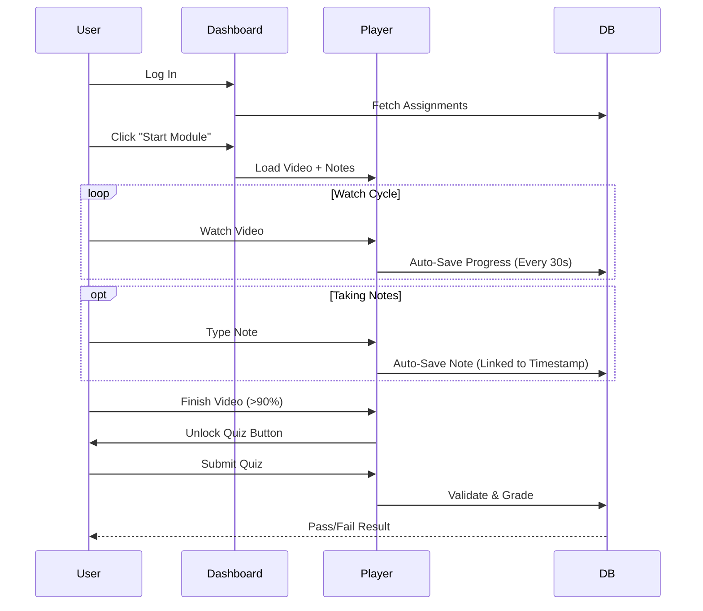
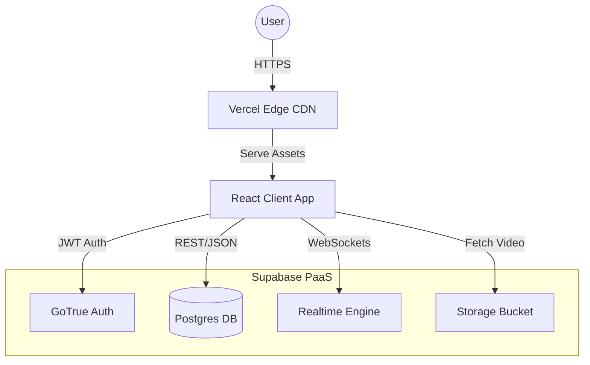
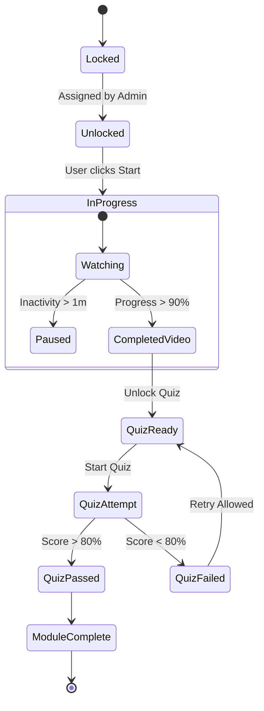

# Learning Tracker App — System Requirements Specification

**Version:** 4.0 (Advanced Architecture Release)  
**Date:** October 26, 2023  
**Status:** **READY FOR IMPLEMENTATION**  
**Author:** Principal Systems Architect  
**Classification:** Internal Team Use

---

## 1. Objective

The **Learning Tracker App** is a streamlined utility designed to operationalize training for a 10-person team. It replaces ad-hoc spreadsheet tracking with a proactive, friction-free system that allows specific video/course assignment, automated progress tracking, and knowledge verification.

**Primary Goal:** Eliminate administrative follow-up time by **80%** while providing learners with a centralized, purpose-built environment for upskilling.

---

## 2. User Personas

### 2.1 Admin Persona: "Manager Mike"
*   **Role:** Engineering Team Lead.
*   **Motivation:** "I need to know my team is compliant without nagging them."
*   **Critical Success Factor:** **Visual Velocity.** He expects to open the dashboard and see a "Green Board" (Team Status) in less than 5 seconds.
*   **Pain Points:** Manually checking Slack messages or Google Sheets to see if someone finished a video.

### 2.2 Learner Persona: "Developer Sarah"
*   **Role:** Software Engineer.
*   **Motivation:** "I need to learn this new skill quickly without administrative hurdles."
*   **Critical Success Factor:** **Cognitive Flow.** She needs to watch, learn, and take notes without fighting a clunky UI.
*   **Pain Points:** Context switching. Losing notes or forgetting which second in a video contained the critical info.

---

## 3. Tech Stack

*Per the project brief, we evaluated three distinct architectural approaches for a lightweight build.*

### Option 1: No-Code / Low-Code (Airtable + Softr)
*   **Concept:** Use a database-driven UI builder.
*   **Strengths:** Fastest time-to-market (< 2 days). Zero code to maintain.
*   **Weaknesses:** Custom interactions (like "Note linked to Video Timestamp") are impossible. UX is generic and rigid.
*   **Verdict:** **Rejected.** Limitations on the core "Note-Taking" feature make this non-viable for the desired UX.

### Option 2: MERN Stack (MongoDB, Express, React, Node)
*   **Concept:** Full bespoke full-stack application.
*   **Strengths:** Infinite flexibility.
*   **Weaknesses:** High operational overhead. Requires hosting, patching, and maintaining a backend server for just 10 users. "Over-engineering."
*   **Verdict:** **Rejected.** Too heavy for the current team size.

### Option 3: Minimal Backend + Static Frontend (Supabase + React) — **RECOMMENDED**
*   **Concept:** "Serverless" architecture. React handles the UI, Supabase handles Auth/Data.
*   **Why it wins:**
    *   **Lightweight:** Zero backend code to manage.
    *   **Professional:** Enterprise-grade Security (RLS) is free.
    *   **Scalable:** Handles the 10-user scale effortlessly but can grow to 10,000.
    *   **UX:** Allows full control over the Video Player interaction.

---

## 4. UI/UX Concept

**Design Philosophy:** "Distraction-Free Professional". Dark mode default, high contrast, focus on content.

### 4.1 Learner Dashboard (The "Focus" View)
*   **Purpose:** Immediate access to the highest-priority task.
*   **Layout Logic:** Vertical Priority Stack.

```text
+---------------------------------------------------------------+
|  [LOGO]  LearningTracker                        [Avatar]      |
+---------------------------------------------------------------+
|                                                               |
|   🎯 ACTIVE PRIORITY                                          |
|   +-------------------------------------------------------+   |
|   |  System Design Principles: CAP Theorem                |   |
|   |  [#####################.......] 72% Complete          |   |
|   |  [ CLICK TO RESUME > ]                                |   |
|   +-------------------------------------------------------+   |
|                                                               |
|   📅 UPCOMING MODULES                                         |
|   |-- React Hooks Deep Dive (Due: Oct 28)                     |
|   |-- PostgreSQL Indexing Strategies (Due: Nov 01)            |
|                                                               |
+---------------------------------------------------------------+
```

### 4.2 Admin Dashboard (The "Green Board" View)
*   **Purpose:** Instant compliance verification (fulfilling "Manager Mike's" need).
*   **Layout Logic:** Traffic Light Status Matrix.

```text
+-----------------------------------------------------------+
|  [MENU]  Team Overview      [+ Assign Module]             |
+-----------------------------------------------------------+
|                                                           |
|  📊 TEAM HEALTH:  🟢 90% Compliant                        |
|                                                           |
|  NAME             MODULE                  STATUS   SCORE  |
|  ---------------  ----------------------  -------  -----  |
|  Sarah Dev        React Hooks             ✅ DONE   100%  |
|  John Backend     PostgreSQL Index        ⏳ 45%     --   |
|  Mike Junior      Git Flow Basics         🔴 LATE    --   |
|                                                           |
|  [ Send "Nudge" to Overdue Users (1) ]                    |
+-----------------------------------------------------------+
```

### 4.3 User Flow Diagram



---

## 5. Key Features

### 5.1 Progress Tracking
*   **FR-01:** System acts as a "Smart Watchdog", tracking video progress via heartbeats (30s intervals).
*   **FR-02:** Scrubber manipulation (skipping ahead) must not count towards "Watch Time".
*   **FR-03:** Modules are only marked "Complete" when Video Progress > 90% AND Quiz Score > 80%.

### 5.2 Knowledge Checks (Quizzes)
*   **FR-04:** Quizzes are Gate-Locked. A user cannot attempt the quiz until the video portion is completed.
*   **FR-05:** System provides "Instant Rationale" feedback immediately after a quiz submission.
*   **FR-06:** Quiz scores are logged permanently for compliance auditing.

### 5.3 Note-Taking Intelligence
*   **FR-07 (Deep Linking):** Notes are timestamp-aware. Clicking a note seeks the video player to that exact moment.
*   **FR-08 (Privacy):** Notes are visible *only* to the author (Learner). Admin has no access.
*   **FR-09:** Notes auto-save to cloud after 1 second of inactivity (Debounce).

---

## 6. Non-Functional Requirements (NFRs)

*   **Usability:** Dashboard Time-to-Interactive **< 800ms**.
*   **Security:** All Data **In** Transit encrypted via TLS 1.3. Row-Level Security (RLS) policies enforced on all database queries.
*   **Reliability:** Offline-Grace mode allows reading previously loaded content if connection drops.
*   **Compatibility:** Mobile-Responsive design for "On-the-Commute" learning.

---

## 7. System Architecture & Flows

### 7.1 High-Level Architecture (C4 Component View)
*   **Frontend:** React SPA (Vite) hosted on Edge CDN.
*   **Backend:** Supabase SaaS (providing Auth, Database, and Realtime subscriptions).



### 7.2 Module State Logic (Flowgraph)
*   **Purpose:** Visualizes the "Smart Tracking" state machine for a single learning module.
*   **Logic:** Enforces the "Video First, Quiz Second" rule.



---

## 8. Deployment Strategy

### 8.1 Hosting Infrastructure
*   **Frontend:** **Vercel** (Recommended for React/Next.js native support).
    *   *Why:* Zero-configuration CI/CD, global edge network, free tier supports 10 users easily.
*   **Backend:** **Supabase Cloud**.
    *   *Why:* Managed PostgreSQL, instant API generation, built-in backups.

### 8.2 CI/CD Pipeline (GitHub Actions)
*   **Trigger:** Push to `main` branch.
*   **Build Step:** `npm run build` (Vite production build).
*   **Test Step:** Run `vitest` unit tests.
*   **Deploy Step:**
    *   *Frontend:* Auto-deploy to Vercel Production.
    *   *Database:* Apply Supabase Migrations (`supabase db push`).

### 8.3 Environment Management
*   **Development:** Localhost + Supabase Local CLI.
*   **Production:** `app.learningtracker.com` + Supabase Production Project.

